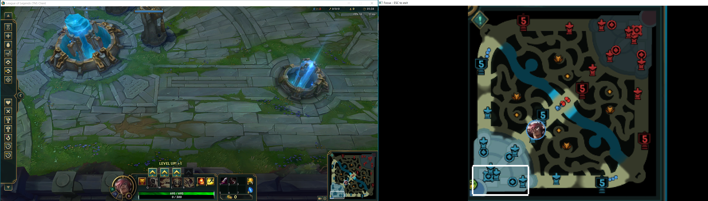
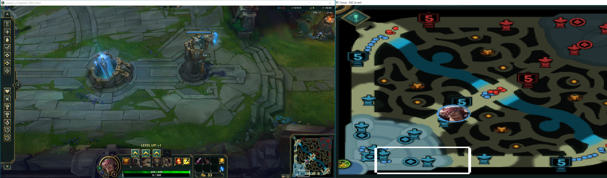
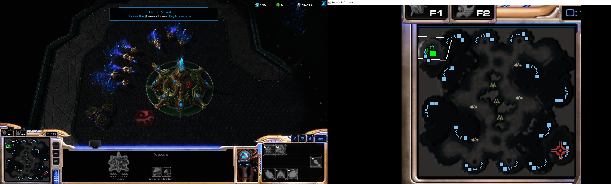
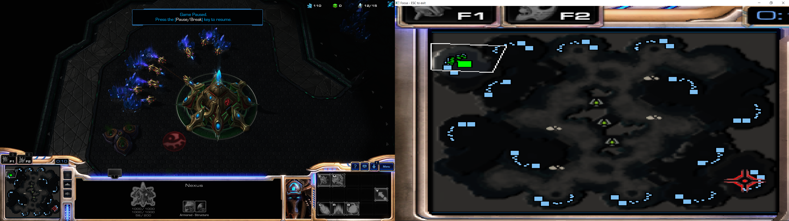

# Focus

### Reproduce and stretch parts of a display to a window



Many of the applications I use or used do not have any support or feature for multiple displays.

I made this to show the map or other parts of a game on another display.

This is a simple way to add support for games for multiple displays. The refresh rate of the window is around 30 fps.

The `builds` directory contains pre-built executables for Windows and Linux.

## Usage

```
Focus 1.0
layderv
Re-draw and stretch a part of a display to a window

USAGE:
    focus.exe [FLAGS] [OPTIONS]

FLAGS:
    -h, --help       Prints help information
    -s, --stretch    Scale mode: AspectRatioStretch by default, fully Stretch otherwise
    -V, --version    Prints version information

OPTIONS:
    -d, --display <display>              The display to capture. By default, the primary display
    -c, --focus_coords <focus-coords>
            Coordinates of the first pixel of `display` to capture. Format: (width, height). Default
            to (0, 0)

    -f, --focus_size <focus-size>
            The rectangle in the display to capture. Default to the whole screen. Format: (width,
            height)

    -w, --window_size <window-size>      The initial size of the new window. Format: (width, height)
```

## Examples

* `focus.exe -f 250,250 -c 1670,775` 
  reproduces the 250x250 rectangle at `(1670,775)` of the primary display and adapt the image to the window

## Screenshots

#### League of Legends - reproduce the map, adapt to aspect ratio


#### League of Legends - reproduce the map and stretch to window size


#### Starcraft2 - reproduce the map, adapt to aspect ratio


#### Starcraft2 - reproduce the map and stretch to window size



## Dependencies
* clap for the cli 
* scrap for capturing the screen of the main display
* minifb for the new window

All of them are cross-platform. This application is cross-platform too.

## Build

As simple as `cargo build`. Stable on rustc 1.49.0.

Ubuntu dependencies: `libxcb-shm0-dev libxcb-randr0-dev libxcb-composite0-dev libxkbcommon-dev`

License: MIT License.
